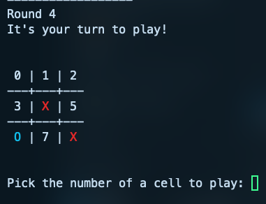

# tic-tac-toe-ml

Play tic-tac-toe in your terminal against a, let's be honest, rather dumb AI. But be careful, the more you play, the more it learns and will eventually become a powerful opponent.

This app is a simple Machine Learning project made like the Donald Michie's [matchbox computer](https://en.wikipedia.org/wiki/Matchbox_Educable_Noughts_and_Crosses_Engine) from 1961, with a simple, yet powerful learning ability.

# How to play

## Pre-requisites

- Make sure you have [Bun](https://bun.sh/) installed.
- Install dependencies

```bash
bun install
```

## Play against the AI

Start the script

```bash
bun run index.ts
```
- AI plays `X`, and human play `O`
- First player is selected randomly. When it's your turn to play you'll be presented with options to play as numbers, simply type the number of the cell you'd like to play and press enter.



The AI will learn after each finished games depending on the outcome.

## Battle of AI

You can let AIs play the game against themselves and see the result of training that way, or start training a model manually and then compare it with untrained AIs, or if you're feeling adventurous, find a way to feed real-life datasets of actual games to speed up training!

For this, pass in the `--battle-of-ai` flag along with the `--number-of-games <number>` option to specify a number of games to play. Example:

```bash
bun run index.ts --battle-of-ai --number-of-games 150000
```

This will let the AIs play 150 000 games against each other. Some informations are displayed while doing so


